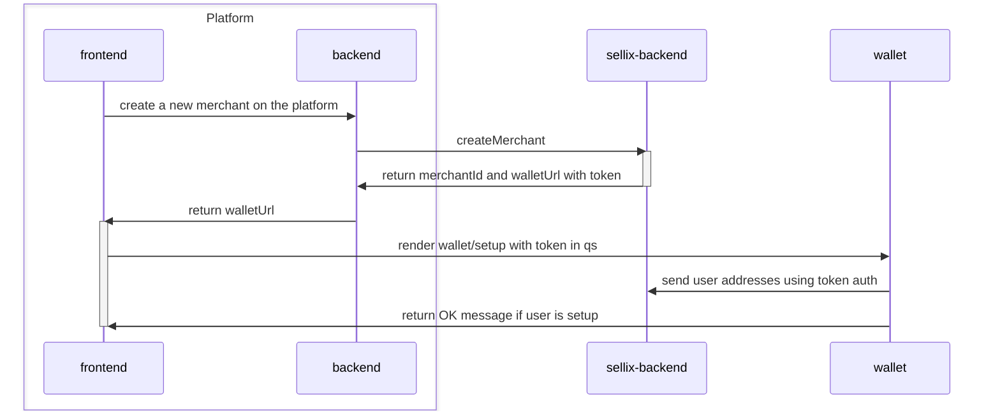
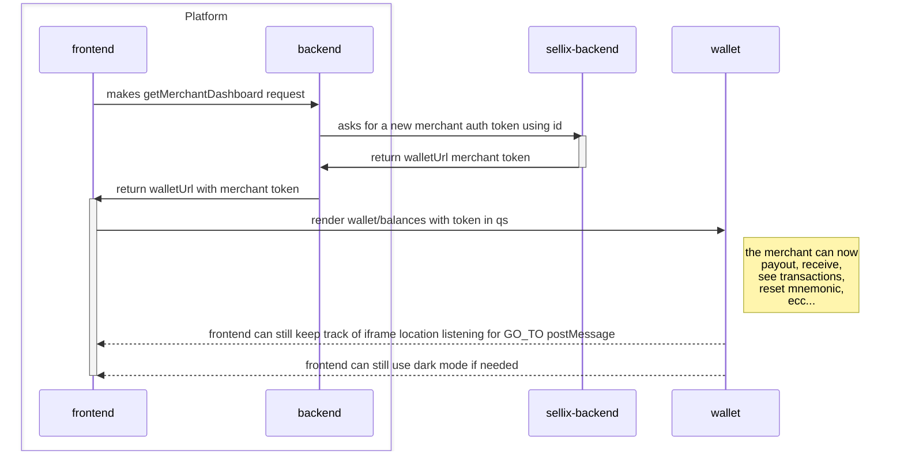

# Platform Wallet Demo
## Dev
```sh
npm run i:all
npm run dev
```


## Platform Overview
### `createMerchant`
- creates a new merchant in the platform db
- call `Sellix API` that returns a merchant id and a token that will be used to authenticate the merchant
- the platform frontend will render Sellix wallet setup page in an iframe with the token as query param
- the merchant will proceed with a regular wallet setup
- when the setup is completed the wallet makes a call directly to Sellix API (instead of using postMessage) to upload the addresses using the token



### `getMerchantDashboard` (merchant sees his wallet/dashboard)
- the merchant calls the platform server to get a token from the sellx API
- the platform frontend renders the `/balances` route of Sellix Wallet using the received token
- the wallet uses the token (instead of receiving postMessage) to make the `self` API call and gets his addresses
- the wallet uses the token (instead of receiving postMessage) to make the `reusable_addresses` api call to check if there is the need to upload new addresses
- the user can see his balances and his transactions
- the user can perform payouts and redeem solana and nano pending funds
- the user can add missing addresses
- the user can perform the forgot mnemonic flow
- the user can add more reusable addresses if requested
- the platform frontend will still be able to keep track of the wallet url listening to its postMessages




## TODOs
- platform server comunicates with Sellix api using some kind of apiKey
- payments?
- concordium flow needs to be implemented entirely inside the wallet iframe
- we need to add the transaction page to the wallet iframe
