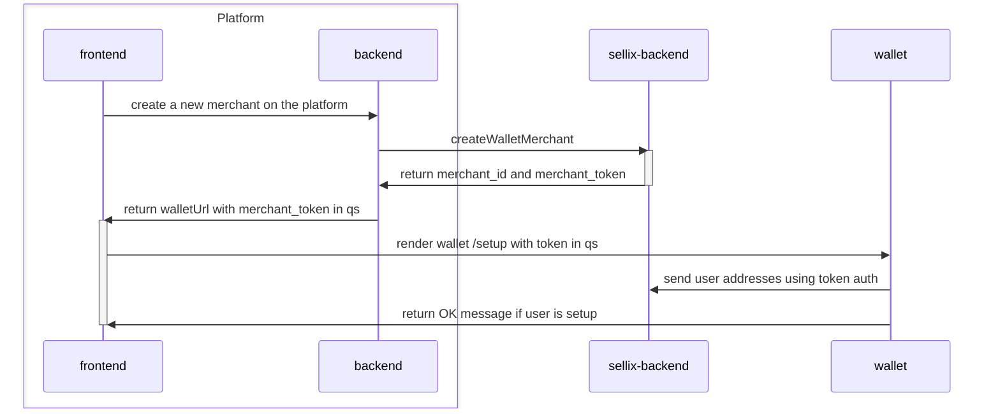
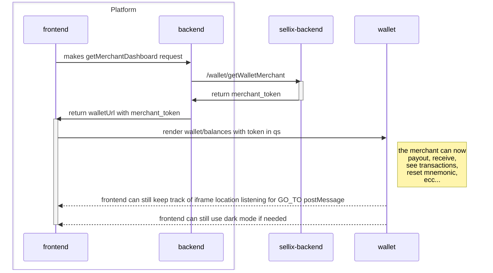
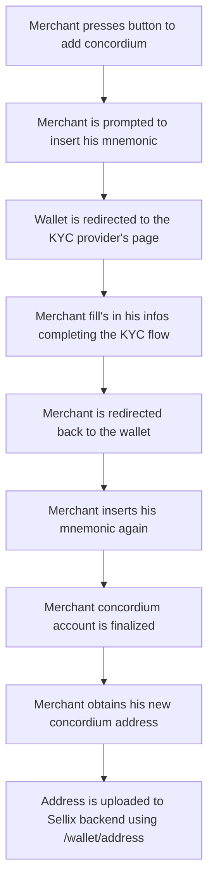

# Platform Wallet Demo
## Dev
To setup the platform demo and try it out follow these steps:
```sh
npm run i:all
cp ./server/.env.sample ./server/.env # add your Sellix API key in this file
npm run dev
```
Then you can go to http://localhost:9998 and press the `signup` button.

## Keywords
- `platform` = the platform that will use Sellix as wallet provider
- `merchant_id` = the user's id in the Sellix ecosystem, every platform user will need a Sellix `merchant_id` to use the wallet
- `merchant` = the user that will use the platform and will be associated with a Sellix `merchant_id`
- `merchant_token` = the token that will be used to authenticate the merchant during the wallet setup and all the other wallet flows, the token has an expiration time and can be refreshed
- `Sellix API key` = the platform owner will be able to retrieve his API key from the Sellix dashboard, the API key will be used by the platform to communicate with the Sellix backend

## Platform Overview
These are the two endpoints that the platform server will need to expose to the platform frontend:
- `createMerchant`
- `getMerchantDashboard`

### `createMerchant`
- implementation [here](./server/index.js)
- the platform frontend calls the platform server to create a new user that will be associated with the Sellix `merchant_id`
- the platform server calls Sellix API using the `Sellix API key` (`/wallet/createWalletMerchant`) that returns a `merchant_id` and a `merchant_token` that will be used to authenticate the merchant
- the platform frontend will render Sellix wallet `/setup` page in an iframe with the `merchant_token` as query param
- the merchant will proceed with a regular wallet setup
- when the setup is completed the wallet makes a call directly to Sellix API (instead of using postMessage) to upload the addresses using the `merchant_token`:
  - `/wallet/address` for all the primary addresses
  - `/wallet/reusable_addresses` for NANO and SOLANA reusable addresses
- concordium will not be setup at this point because it requires a different setup flow (see below)



### `getMerchantDashboard` (merchant sees his wallet/dashboard)
- implementation [here](./server/index.js)
- the merchant calls the platform server to get the wallet url
- the platform server calls Sellix API using the `Sellix API key` (`/wallet/getWalletMerchant`) that returns a `merchant_id` and a `merchant_token` that will be used to authenticate the merchant
- the platform frontend renders the wallet iframe using the wallet url with the merchant token
- the wallet uses the merchant token (instead of receiving postMessage) to make the `/wallet/self` API call to get the merchant addresses created during the setup phase
- the wallet uses the merchant token (instead of receiving postMessage) to make the `/wallet/estimate/<currency>/reusable_addresses` API call to check if there is the need to upload new addresses
- now the wallet is able to perform the following operations in a seameless way like you would do in the Sellix dashboard:

#### `payout`
- pressing the send button in the `/balances` screen the merchant will see the payout screen
- from here the merchant can select the currency and the address to send the funds to.

#### `redeem`
- pressing the redeem button in the `/balances` screen the merchant will see the redeem screen
- the merchant can now redeem his SOLANA or NANO pending funds in his wallet

#### `add missing addresses`
- if during the setup flow some cryptos weren't configured due to some problem, their corresponding row will appear at the bottom of the `/balances` screen in the `additional cryptos` section
- the merchant presses on the row and inserts his mnemonic to generate the addresses for the missing cryptos

#### `reset mnemonic`
- if the merchant forgets his mnemonic he can press the `reset mnemonic` button when prompted to.
- the merchant can regenerate his addresses using a new mnemonic

#### `add more reusable addresses`
- TODO: link to reusable addresses documentation
- if the merchant needs to add more reusable addresses he can press the `add more addresses` button when prompted to.
- the merchant will be prompted to insert his mnemonic to generate more addresses



## Navigation
The wallet iframe will emit a `GO_TO` postMessage to the platform frontend so that the platform can keep track of the wallet current navigation state, this way the platform frontend can change its UI accordingly to the current wallet page

## Dark mode
The wallet iframe can be rendered adding a `dark = true` query parameter to the wallet url, this way the wallet will be rendered in dark mode

## Payments
Payments work with the standard [Sellix Payments API](https://developers.sellix.io) integration, the platform only has to pass the additional field `platform_on_behalf_of`, which equals to the ID of the platform-merchant created through the create merchant endpoint.

It will return a checkout URL where you can redirect the customer to send the payment.

The platform can also pass any custom fee when creating the payment, which will be charged to the customer.

```json
{
  "platform_fee": {
    "percentage": 5,
    "fixed_fee": 0.10
  }
}
```

The fixed fee is always taken as `USD`, it will be added on top of any percentage passed.

Sample code snippets

PHP
```php
<?php

$curl = curl_init();

$data = [
  "platform_on_behalf_of" => "plat_149ffc-d0acb95171-sample",
	"title" => "Platform Payment",
	"value" => 2.50,
	"currency" => "USD",
  "platform_fee" => [
    "percentage" => 5,
    "fixed_fee" => 0.10
  ],
	"email" => "example@gmail.com",
  "white_label" => false,
	"webhook" => "https://webhook.sellix.io/api/v1/example",
	"return_url" => "https://sample.sellix.io/success"
]

curl_setopt_array($curl, array(
  CURLOPT_URL => 'https://dev.sellix.io/v1/payments',
  CURLOPT_RETURNTRANSFER => true,
  CURLOPT_ENCODING => '',
  CURLOPT_MAXREDIRS => 10,
  CURLOPT_TIMEOUT => 0,
  CURLOPT_FOLLOWLOCATION => true,
  CURLOPT_HTTP_VERSION => CURL_HTTP_VERSION_1_1,
  CURLOPT_CUSTOMREQUEST => 'POST',
  CURLOPT_POSTFIELDS => json_encode($data),
  CURLOPT_HTTPHEADER => array(
    'Content-Type: application/json',
    'Authorization: Bearer YOUR_API_KEY'
  ),
));

$response = curl_exec($curl);

curl_close($curl);
print_r($response);
```

NodeJS
```js
const request = require('request');
const options = {
  'method': 'POST',
  'url': 'https://dev.sellix.io/v1/payments',
  'headers': {
    'Content-Type': 'application/json',
    'Authorization': 'Bearer YOUR_API_KEY'
  },
  body: JSON.stringify({
    "platform_on_behalf_of": "plat_149ffc-d0acb95171-sample",
    "title": "Platform Payment",
    "value": 2.5,
    "currency": "USD",
    "platform_fee": {
      "percentage": 5,
      "fixed_fee": 0.10
    },
    "email": "example@gmail.com",
    "white_label": false,
    "webhook": "https://webhook.sellix.io/api/v1/example",
    "return_url": "https://sample.sellix.io/success"
  })
};

request(options, function (error, response) {
  if (error) throw new Error(error);
  console.log(response.body);
});
```

Python
```python
import requests
import json

url = "https://dev.sellix.io/v1/payments"

payload = json.dumps({
  "platform_on_behalf_of": "plat_149ffc-d0acb95171-sample",
  "title": "Platform Payment",
  "value": 2.5,
  "currency": "USD",
  "platform_fee": {
    "percentage": 5,
    "fixed_fee": 0.10
  },
  "email": "example@gmail.com",
  "white_label": False,
  "webhook": "https://webhook.sellix.io/api/v1/example",
  "return_url": "https://sample.sellix.io/success"
})
headers = {
  'Content-Type': 'application/json',
  'Authorization': 'Bearer YOUR_API_KEY'
}

response = requests.request("POST", url, headers=headers, data=payload)

print(response.text)
```

## Concordium setup flow
Concordium needs a different setup flow because it requires the merchant to perform a KYC process.
- the wallet prompts the merchant to insert his mnemonic
- the iframe location is redirected to the Concordium KYC provider page (without leaving the platform page)
- the merchant performs the KYC process
- the iframe location is redirected back to the wallet
- the merchant is asked again to insert his mnemonic and his account will be created
- the address is uploaded to sellix backend using the `/wallet/address` endpoint


## Sellix Endpoints
Listed down here are the endpoints that Sellix backend uses to interact with the platform
### POST `/wallet/merchant` (API key auth)
- the platform calls Sellix API to create a new merchant
- the endpoint will require all the needed user information to create a new merchant:
```js
{
  email: "merchant@merchant.com", // unique
  name: "merchantName", // unique
  custom_fields: {} // object or null, the platform can pass additional information that can be later retrieved using GET /wallet/merchant
}
```
- the endpoint returns:
```js
{
  status: 200,
  data: {
    merchant: {
      id: 'plat_....',
      name: 'merchantName',
      email: 'merchant@merchant.com',
      custom_fields: null,
      token: 'platform_token_....',
      expire_at: 00000000
    }
  },
  error: null,
  message: null,
  env: 'production'
}
```

### GET `/wallet/merchant/<merchant_id>` (API key auth)
- the platform calls Sellix API to retrive the `merchant_token` that will be used to authenticate the merchant during ALL the other wallet flows listed above.
- the endpoint will require the `merchant_id` as parameter
- the endpoint returns:
```js
{
  status: 200,
  data: {
    merchant: {
      id: 'plat_....',
      name: 'merchantName',
      email: 'merchant@merchant.com',
      custom_fields: null,
      token: 'platform_token_....',
      expire_at: 00000000
    }
  },
  error: null,
  message: null,
  env: 'production'
}
```


## Integration Guide - Setup
The setup flow consists in a few steps that the platform has to follow in order to make the setup of new users proceed correctly.
Firstly the platform needs to integrate in its user system a way to store the `merchant_id` returned from sellix.
When the platform's backend calls `/wallet/merchant` the user will be added to the Sellix backend, as the response you will get the `merchant_token` and the `merchant_id` with the additional information that you passed calling `/wallet/merchant`.

For example, in this phase you should add the `merchant_id` to the corresponding column in you User table in your database

Now the user needs to complete the wallet setup flow to create his crypto addresses. In order to do that, the Platform frontend has to render the iframe that will host the wallet.
To use correctly the wallet iframe the platform needs to pass a few parameters in query string while rendering the wallet, here's an example in JavaScript
```js
const qs = new URLSearchParams({
  token, // required, the token got from /wallet/merchant, the one starting with "platform_token_..."
  platform_id: encodeURIComponent("platform-demo"), // required, a string identifying the platform, you can use what you want, the end users will not see this value
  setup_finish_link: "http://localhost:9998/login.html" // required, a url of your page used to redirect the user once the setup is completed
  dark: true // non required, whether the wallet should be shown in dark mode or not, do not pass the flag or leave undefined for light mode
})
```

```html
<iframe
  src="<wallet_url>/setup?<qs>"
  sandbox="allow-scripts allow-same-origin allow-downloads allow-popups allow-top-navigation"
  allow=""
  referrerpolicy="unsafe-url"
>
</iframe>
```
## Integration Guide - Usage
Once the user is setup he has access to all the rest of the wallet functionalities.
The plaform frontend makes a call to the backend that will get his `merchant_token` using GET `/wallet/merchant/<merchant_id>`.
Now the wallet iframe can be rendered using the token with the same parameters as above on the `/balances` page
```html
<iframe
  src="<wallet_url>/balances?<qs>"
  sandbox="allow-scripts allow-same-origin allow-downloads allow-popups allow-top-navigation"
  allow=""
  referrerpolicy="unsafe-url"
>
</iframe>
```
## Integration Guide - Concordium
Concordium needs a different KYC process to create an account and get the merchant's address so to support Concordium for the platform users you will need to add an additional parameter in the query string (`redirect_uri`), when the users presses `Configure` to add Concordium, is brought to the KYC provider page, once the KYC is completed the user will be redirected back using this `redirect_uri`
```js
const qs = new URLSearchParams({
  token,
  platform_id: encodeURIComponent("platform-demo"),
  redirect_uri: "http://localhost:9998/complete-concordium-setup.html", // <-- this one
  setup_finish_link: "http://localhost:9998/login.html"
})
```
In this example we created a different html page to complete Concodium setup, you can do as you like, the only constrant is that the iframe on the complete concordium uri has to be rendered using these parameters:
```js
const qs = new URLSearchParams({
  token,
  platform_id: encodeURIComponent("platform-demo"),
  url: encodeURIComponent(window.location.toString().split("#")[1]), // <-- get's the code uri that will be address to your redirect uri, used to complete concordium setup
  setup_finish_link: "http://localhost:9998/login.html"
})
```
And the iframe should be rendered like this:
```html
<iframe
  src="<walletUrl>/complete-concordium-setup?<qs>"
  width="780px"
  height="605px"
  sandbox="allow-forms allow-scripts allow-same-origin allow-downloads allow-popups allow-top-navigation"
  allow=""
  referrerpolicy="no-referrer"
>
</iframe>
```
## Integration Guide - Query parameters overview
Here's the list of all the accepted query parameters that can be passed to the wallet iframe url
### `token` (required)
The `merchant_token` that starts with `platform_token_...` is used to authenticate the user while comunicating with sellix backend
### `platform_id` (required)
A string containing the platform name that will be used to store correctly the merchant token in the user's Session Storage
### `setup_finish_link` (required)
A url pointing to a platform page, this will be used in various instances:
- when the user completes the setup of his addresses on the `/setup` page, the last `complete` button will redirect the user using this link
- when the user performs the `forgot mnemonic` flow and completes it, the last `complete` button will redirect the user using this link
- when the user performs the `concordium setup` flow, the last `complete` button will redirect the user using this link
### `dark` (non required)
If passed the only accepted value is `true`, it will render the iframe using dark color palette instead of light
### `redirect_uri` (non required)
If passed the users will be able to perform the `concordium setup` flow, else the users won't be able to use concordium at all.
This is a url pointing to a page in the platform frontend that will handle the redirect after the user completes the KYC process.
The url in the returning page will look like this if we pass `http://localhost:9998/complete-concordium-setup.html` as `redirect_uri`:
```
http://localhost:9998/complete-concordium-setup.html#code_uri=...
```
### `url` (non required)
It is required when rendering the iframe in the `/complete-concordium-setup` page. You have to pass the string after the `#` character like in the example:
```js
// ...
const url = encodeURIComponent(window.location.toString().split("#")[1])
// ...
```
