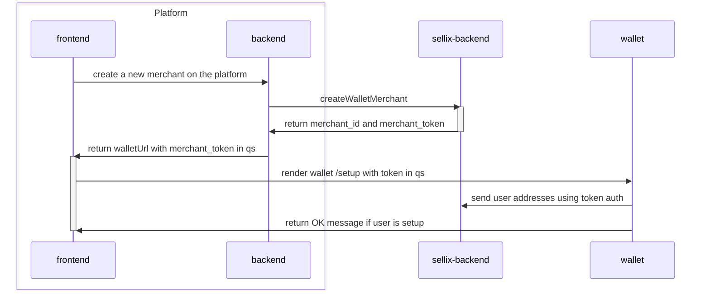
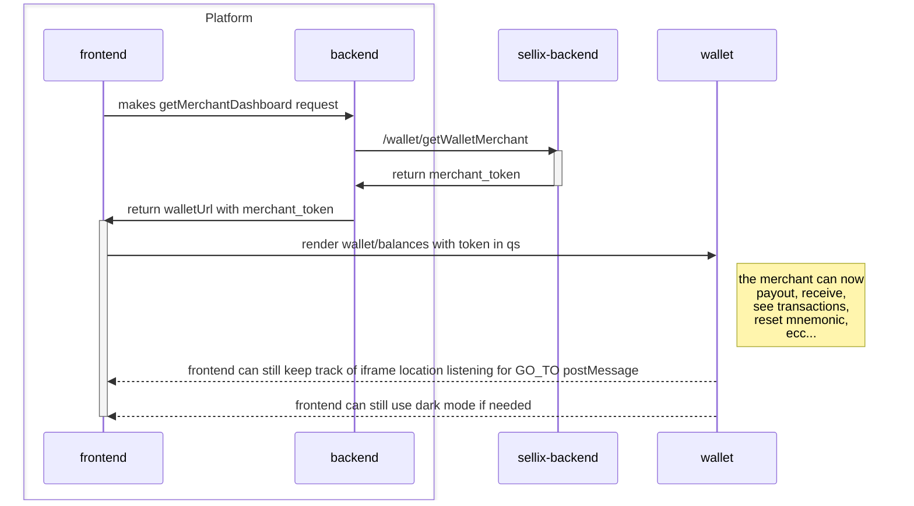
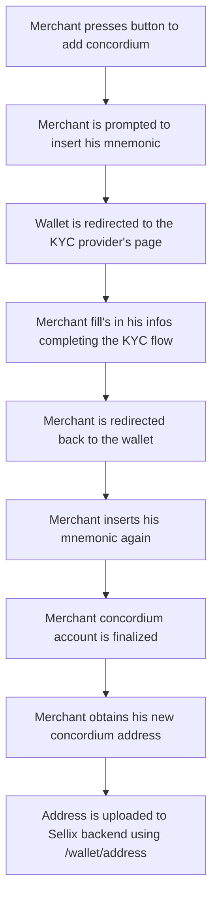

# Platform Wallet Demo
## Dev
```sh
npm run i:all
npm run dev
```
## Keywords
- `platform` = the platform that will use Sellix as wallet provider
- `merchant_id` = the user's id in the Sellix ecosystem, every platform user will need a Sellix `merchant_id` to use the wallet
- `merchant` = the user that will use the platform and will be associated with a Sellix `merchant_id`
- `merchant_token` = the token that will be used to authenticate the merchant during the wallet setup and all the other wallet flows, the token has an expiration time and can be refreshed
- `Sellix API key` = the platform owner will be able to retrieve his API key from the Sellix dashboard, the API key will be used by the platform to communicate with the Sellix backend

## Platform Overview
These are the two endpoints that the platform server will need to expose to the platform frontend:
- `createMerchant`
- `getMerchantDashboard`

### `createMerchant`
- implementation [here](./server/index.js)
- the platform frontend calls the platform server to create a new user that will be associated with the Sellix `merchant_id`
- the platform server calls Sellix API using the `Sellix API key` (`/wallet/createWalletMerchant`) that returns a `merchant_id` and a `merchant_token` that will be used to authenticate the merchant
- the platform frontend will render Sellix wallet `/setup` page in an iframe with the `merchant_token` as query param
- the merchant will proceed with a regular wallet setup
- when the setup is completed the wallet makes a call directly to Sellix API (instead of using postMessage) to upload the addresses using the `merchant_token`:
  - `/wallet/address` for all the primary addresses
  - `/wallet/reusable_addresses` for NANO and SOLANA reusable addresses
- concordium will not be setup at this point because it requires a different setup flow (see below)



### `getMerchantDashboard` (merchant sees his wallet/dashboard)
- implementation [here](./server/index.js)
- the merchant calls the platform server to get the wallet url
- the platform server calls Sellix API using the `Sellix API key` (`/wallet/getWalletMerchant`) that returns a `merchant_id` and a `merchant_token` that will be used to authenticate the merchant
- the platform frontend renders the wallet iframe using the wallet url with the merchant token
- the wallet uses the merchant token (instead of receiving postMessage) to make the `/wallet/self` API call to get the merchant addresses created during the setup phase
- the wallet uses the merchant token (instead of receiving postMessage) to make the `/wallet/estimate/<currency>/reusable_addresses` API call to check if there is the need to upload new addresses
- now the wallet is able to perform the following operations in a seameless way like you would do in the Sellix dashboard:

#### `payout`
- pressing the send button in the `/balances` screen the merchant will see the payout screen
- from here the merchant can select the currency and the address to send the funds to.

#### `redeem`
- pressing the redeem button in the `/balances` screen the merchant will see the redeem screen
- the merchant can now redeem his SOLANA or NANO pending funds in his wallet

#### `add missing addresses`
- if during the setup flow some cryptos weren't configured due to some problem, their corresponding row will appear at the bottom of the `/balances` screen in the `additional cryptos` section
- the merchant presses on the row and inserts his mnemonic to generate the addresses for the missing cryptos

#### `reset mnemonic`
- if the merchant forgets his mnemonic he can press the `reset mnemonic` button when prompted to.
- the merchant can regenerate his addresses using a new mnemonic

#### `add more reusable addresses`
- TODO: link to reusable addresses documentation
- if the merchant needs to add more reusable addresses he can press the `add more addresses` button when prompted to.
- the merchant will be prompted to insert his mnemonic to generate more addresses



## Navigation
the wallet iframe will emit a `GO_TO` postMessage to the platform frontend so that the platform can keep track of the wallet current navigation state, this way the platform frontend can change its UI accordingly to the current wallet page

## Dark mode
the wallet iframe can be rendered adding a `dark = true` query parameter to the wallet url, this way the wallet will be rendered in dark mode

## Payments
WIP

## Concordium setup flow
Concordium needs a different setup flow because it requires the merchant to perform a KYC process.
- the wallet prompts the merchant to insert his mnemonic
- the iframe location is redirected to the Concordium KYC provider page (without leaving the platform page)
- the merchant performs the KYC process
- the iframe location is redirected back to the wallet
- the merchant is asked again to insert his mnemonic and his account will be created
- the address is uploaded to sellix backend using the `/wallet/address` endpoint


## New Sellix Endpoints
Listed down here are the endpoints that Sellix backend uses to interact with the platform
### `/wallet/createWalletMerchant` (API key auth)
- the platform calls Sellix API to create a new merchant
- the endpoint will require all the needed user information to create a new merchant: WIP
- the endpoint will return the `merchant_id` and the `merchant_token` that will be used to authenticate the merchant during the wallet setup.

### `/wallet/getWalletMerchant` (API key auth)
- the platform calls Sellix API to retrive the `merchant_token` that will be used to authenticate the merchant during ALL the other wallet flows listed above.
- the endpoint will require the `merchant_id` as parameter

### `/wallet/refreshMerchantToken` (Merchant token auth)
- the wallet calls Sellix API to refresh the `merchant_token` that will expire after a certain amount of time.

## TODOs
- we need to add the transaction page to the wallet iframe
