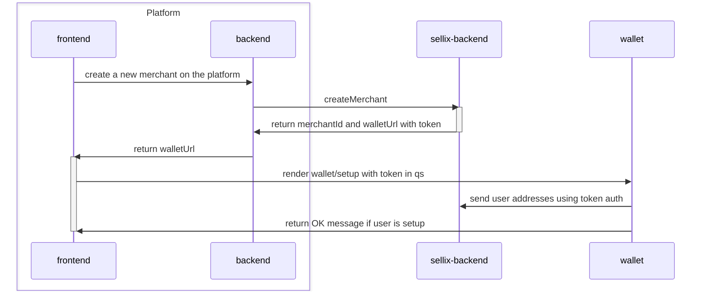
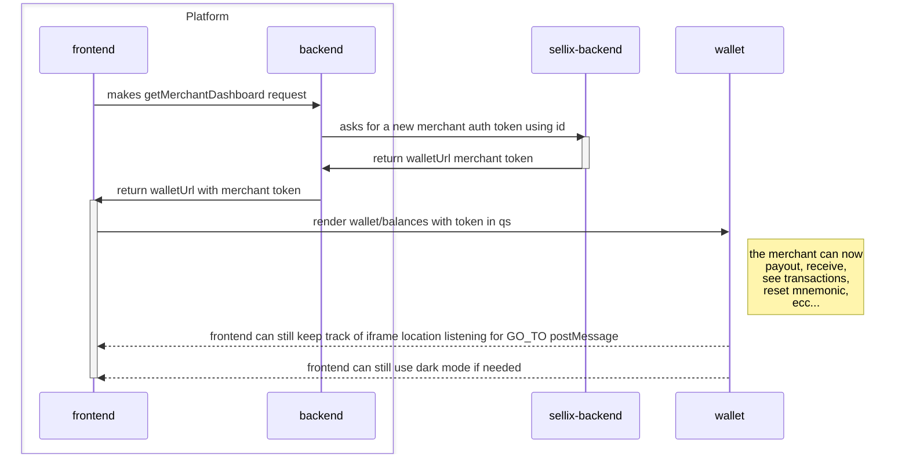

# Platform Wallet Demo
## Dev
```sh
npm run i:all
npm run dev
```


## Platform Overview
### `createMerchant`
- the platform frontend calls the platform server to create a new user that will be associated with the Sellix `merchant_id`
- call `Sellix API` that returns a `merchant_id` and a `merchant_token` that will be used to authenticate the merchant
- the platform frontend will render Sellix wallet setup page in an iframe with the merchant token as query param
- the merchant will proceed with a regular wallet setup
- when the setup is completed the wallet makes a call directly to Sellix API (instead of using postMessage) to upload the addresses using the merchant token (`/wallet/address` and `/wallet/reusable_addresses`)



### `getMerchantDashboard` (merchant sees his wallet/dashboard)
- the merchant calls the platform server to get the wallet url to the `/balances` page with a merchant token from the Sellx API
- the platform frontend renders the wallet iframe using the received url with the merchant token
- the wallet uses the merchant token (instead of receiving postMessage) to make the `/wallet/self` API call and gets his addresses
- the wallet uses the merchant token (instead of receiving postMessage) to make the `/wallet/estimate/<currency>/reusable_addresses` API call to check if there is the need to upload new addresses
- the platform frontend will still be able to keep track of the wallet url listening to its postMessages (eg. `GO_TO` to keep track of the iframe location)
- now the wallet is able to perform these operations in a seameless way like you would do in the Sellix dashboard:

#### `payout`
- pressing the send button in the `/balances` screen the merchant will see the payout screen
- from here the merchant can select the currency and the address to send the funds to.

#### `redeem`
- pressing the redeem button in the `/balances` screen the merchant will see the redeem screen
- the merchant can now redeem his SOLANA or NANO pending funds in his wallet

#### `add missing addresses`
- if the merchant has missing addresses their corresponding row will appear at the bottom of the `/balances` screen
- the merchant presses on the row and inserts his mnemonic to generate the missing addresses

#### `reset mnemonic`
- if the merchant forgets his mnemonic he can press the `reset mnemonic` button when prompted to.
- the merchant can regenerate his addresses using a new mnemonic

#### `add more resusable addresses`
- if the merchant needs to add more reusable addresses he can press the `add more addresses` button when prompted to.
- the merchant will be prompted to insert his mnemonic to generate more addresses




## Sellix API key
The platform owner will be able to visit the Sellix dashboard to retrieve his API key that will be used by his platform to comunicate with the Sellix backend.

## Payments
WIP

## Concordium setup flow
Concordium needs a different setup flow because it requires the user to perform a KYC process.
- the wallet prompts the user to insert his mnemonic
- the iframe location is redirected to the Concordium KYC provider page (without leaving the platform page)
- the user performs the KYC process
- the iframe location is redirected back to the wallet
- the user is asked again to insert his mnemonic and his account will be created


## New Sellix Endpoints
All the new Sellix API endpoints that need to be implemented in the Sellix backend are listed here.
### `createWalletMerchant` (API key auth)
- the platform calls the Sellix API to create a new merchant
- the endpoint will require all the needed user information to create a new merchant
- the endpoint will return the `merchant_id` and a wallet url containing the `merchant_token` that will be used to authenticate the merchant during the wallet setup.

### `getWalletMerchant` (API key auth)
- the platform calls the Sellix API to retrive a wallet url containing the `merchant_token` that will be used to authenticate the merchant during ALL the other wallet flows listed above.
- the endpoint will require the `merchant_id` as parameter

### `refreshMerchantToken` (Merchant token auth)
- the wallet calls the Sellix API to refresh the `merchant_token` that will expire after a certain amount of time.

## TODOs
- we need to add the transaction page to the wallet iframe
